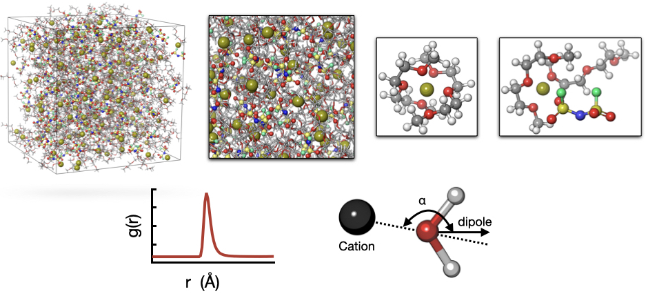

:orphan:

.. title:: MISPR documentation

.. module:: mispr

.. toctree::
   :hidden:

   overview
   keywords

.. toctree::
   :caption: Installation 🔧
   :hidden:
   :titlesonly:

   Overview <installation/index>
   Prerequisites <installation/dependencies>
   Configuration Files <installation/configuration>
   Running a Test Workflow <installation/test>

.. toctree::
   :caption: Workflows 🔀
   :hidden:

   workflows/basics
   workflows/supported
   workflows/tutorials
   workflows/custom

.. toctree::
   :caption: Resources 🖇️
   :hidden:

   resources/faq
   resources/resources

.. toctree::
   :caption: Code Documentation 📚
   :hidden:
   :titlesonly:

   mispr <mispr>

.. toctree::
   :caption: Development 💻
   :hidden:

   changelog
   citing
   license

##################################
MISPR |release| Documentation
##################################

MISPR automates hierarchical density functional theory (DFT) and
classical molecular dynamics (MD) workflows for computing the properties
of liquid-solution materials. DFT runs through
`Gaussian <https://gaussian.com>`_ or, for the molecular-level workflows
(ESP, bond dissociation energy, binding energy), through
`ORCA <https://www.faccts.de/orca/>`_ -- a free, license-free alternative.
MD simulations run through `LAMMPS <https://www.lammps.org>`_.

New here? Start with the :doc:`Overview <overview>` to see what MISPR
does, then follow the :doc:`installation guide <installation/index>`, then
work through a :doc:`tutorial <workflows/tutorials>`.

*************
Installation
*************

Install using pip (from this repository -- the
`PyPI release <https://pypi.org/project/mispr/>`__ does not include the
ORCA backend):

.. code-block:: bash

    pip install git+https://github.com/RuiqiLuo/mispr-psi4.git

.. important::
   Before you can start using MISPR, there are additional steps you need to follow.
   Please refer to the :doc:`installation guide <installation/index>` for complete setup instructions,
   including any dependencies or configuration files required.

*******************
Learning Resources
*******************

- :doc:`Overview <overview>` -- what MISPR is and does
- :doc:`Dependencies and prerequisites <installation/dependencies>`
- :doc:`Workflow basics <workflows/basics>` and :doc:`supported workflows <workflows/supported>`
- :doc:`Tutorials <workflows/tutorials>` -- runnable, step-by-step examples
- :doc:`MISPR FAQ <resources/faq>`
- :doc:`Code documentation (subpackages) <mispr>`

************************************
Contributing / Reporting / Support
************************************
Contributing to MISPR can be in the form of:

* Requesting or adding new workflows and features
* Reporting or fixing bugs and issues
* Contributing to the documentation and/or examples

To add or change something in this fork (ORCA backend, docs, examples),
fork `RuiqiLuo/mispr-psi4 on GitHub <https://github.com/RuiqiLuo/mispr-psi4>`_
and submit a pull request there. For changes to core MISPR unrelated to
the ORCA backend, submit them upstream to
`molmd/mispr <https://github.com/molmd/mispr>`_ instead.

If you submit a bug report, we will review it and move it to GitHub issues,
where its progress can be tracked.

For other inquiries, please contact us at rasha.atwi@stonybrook.edu. For
questions specific to the ORCA backend in this fork, contact
ruiqi.luo@stonybrook.edu.

