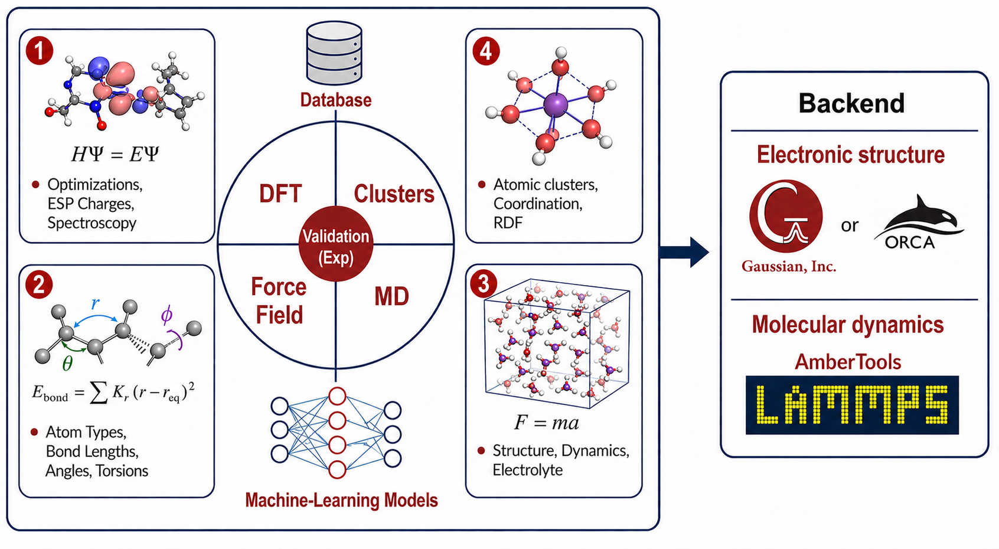

==========
Overview
==========
MISPR (Materials Informatics for Structure-Property Relationships) is a
high-throughput computational infrastructure aimed at guiding and
accelerating materials discovery, optimization, and deployment for
liquid solutions by seamlessly integrating density functional theory
(DFT) with classical molecular dynamics (MD) techniques.

MISPR is motivated by the Materials Genome Initiative (MGI) principles and is
built on top of open-source Python packages developed for the `Materials
Project <https://materialsproject.org>`_ such as `pymatgen <https://pymatgen.org>`_,
`FireWorks <https://materialsproject.github.io/fireworks/>`_ ,
and `custodian <https://materialsproject.github.io/custodian/>`_, as
well as `MDPropTools <https://github.com/molmd/mdproptools>`_, which
is an in-house package for analyzing MD output and trajectory files.

**Features of MISPR include**:

* Automates DFT and MD simulations end-to-end -- file management, job
  submission, output parsing, data analytics -- for a single molecule
  or thousands of systems in parallel

* Builds computational databases of force-field parameters and
  DFT/MD-derived properties for structure-property analysis and
  reproducibility

* Detects and auto-corrects common simulation errors on the fly,
  reducing manual intervention in high-throughput runs

* Provides tested DFT workflows for electrostatic partial charges (ESP),
  bond dissociation energy, binding energy, redox potential, and nuclear
  magnetic resonance (NMR) tensors -- runnable with
  `Gaussian <https://gaussian.com>`_ or, for all but NMR,
  `ORCA <https://www.faccts.de/orca/>`_ (free for academic use,
  registration required) behind the same workflow interface, producing
  directly comparable results -- see
  :doc:`Workflow Tutorials <workflows/tutorials>` for how to use the
  ORCA backend

* Derives ensemble properties -- radial distribution functions,
  diffusion coefficients, viscosity, conductivity -- from MD
  trajectories of liquid solutions

* Links DFT and MD through hybrid workflows: force-field generation and
  data flow between the two length scales, across chemical and
  parameter spaces (temperature, pressure, concentration, etc.) that
  would be infeasible to explore manually

* Extracts solvation structures from MD ensembles for use in DFT
  workflows, improving the accuracy of energetics, NMR chemical shifts,
  and redox potentials against experimental data