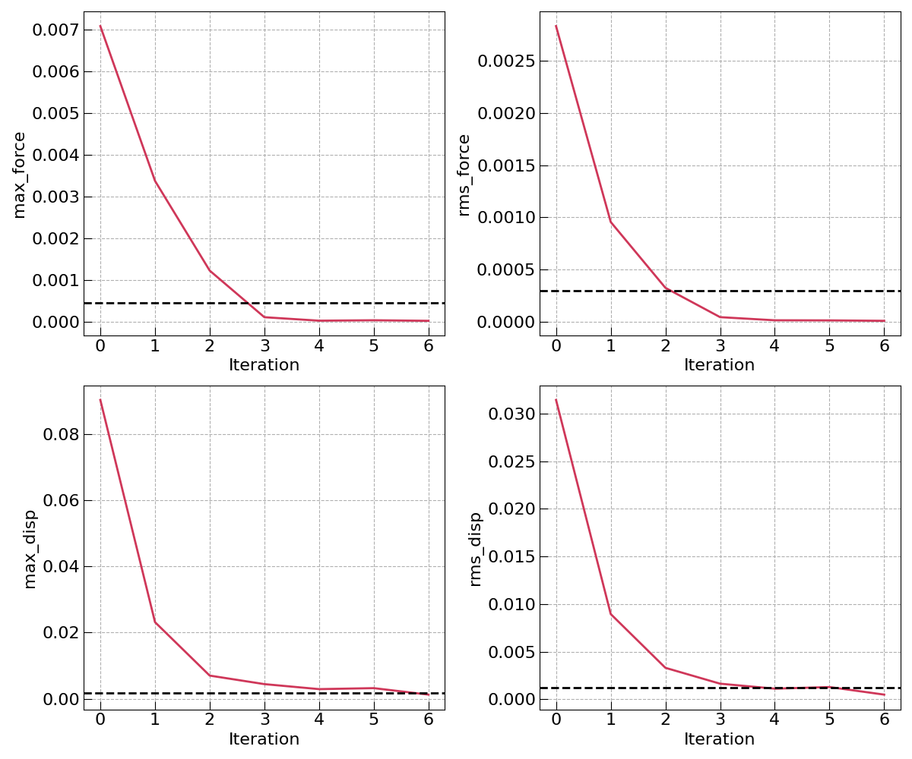

===================
Workflow Tutorials
===================

This page shows how to run MISPR's DFT workflows and how to read their
results. Three workflows appear throughout, each named after the property it
computes:

* **ESP** (electrostatic partial charges) -- fits a partial charge to every
  atom of a molecule; the standard input for building classical force
  fields.
* **BDE** (bond dissociation energy) -- how much energy it takes to break
  each bond of a molecule.
* **Binding energy** -- how strongly two molecules stick together when they
  form a complex.

Each workflow is a fixed recipe of calculation steps. MISPR builds the
recipe; `FireWorks <https://materialsproject.github.io/fireworks/>`_ stores
it in your MongoDB database and executes it. Four FireWorks words are used
on this page without further ceremony:

* a **workflow** is the whole recipe, made of individual jobs called
  **Fireworks**;
* the **LaunchPad** is the database-backed queue that workflows are
  submitted to and run from;
* each Firework's state moves from ``READY`` to ``RUNNING`` to
  ``COMPLETED`` -- or to ``FIZZLED``, FireWorks' word for *failed*.

.. important::
   Before anything on this page can work, the
   :doc:`installation <../installation/index>` must be finished: ``import
   mispr`` succeeds in your environment, the
   :doc:`configuration files <../installation/configuration>` are written,
   and your MongoDB database is reachable from the machine you run on.

Using the ORCA backend
------------------------------
As of version 0.0.5, the ``bde``, ``binding_energy``, and ``esp`` workflows are
also available with an `ORCA <https://www.faccts.de/orca/>`_ backend
(``mispr.orca.workflows.base``). The workflow functions have the same names and
arguments as their Gaussian counterparts -- only the import path changes.
This section is a complete, self-contained guide: environment setup, ORCA
installation, running each workflow, and how to read the results out of the
database.

Step 1: Set up the environment
~~~~~~~~~~~~~~~~~~~~~~~~~~~~~~~~~~~

The ORCA backend needs the same base environment as the rest of MISPR (see
:doc:`Prerequisites <../installation/dependencies>` for full details). In
short, on a cluster this means a conda environment with MISPR and its Python
dependencies installed::

    conda create -n mispr python=3.10
    conda activate mispr
    pip install -e /path/to/your/mispr/clone     # editable install of this repo

plus the four FireWorks/MISPR configuration files (``FW_config.yaml``,
``db.json``, ``my_launchpad.yaml``, ``my_fworker.yaml``) in a config directory.
These are the files that tell MISPR where your MongoDB database lives; they are
engine-independent -- if you already ran Gaussian workflows with MISPR,
the exact same config directory works for ORCA unchanged.

.. important::
   ``FW_CONFIG_FILE`` must be set **before** any ``fireworks``/``mispr`` import
   is executed -- fireworks reads this environment variable once, at import
   time. Setting it after the imports is the single most common cause of
   ``FileNotFoundError: Please provide the database configurations``. In a
   Jupyter notebook, also remember that editing/pulling new MISPR code requires
   a **kernel restart** to take effect (Python caches imported modules).

Step 2: Install ORCA
~~~~~~~~~~~~~~~~~~~~~~~~~~~~~~~~~~~

The ORCA backend was developed and validated against **ORCA 6.1.1**; any ORCA
6.x release is expected to work (the output parser keys on stable markers of
the ORCA 6 output format such as ``FINAL SINGLE POINT ENERGY`` and the
``VIBRATIONAL FREQUENCIES`` section).

1. Register (free for academic use) on the
   `ORCA forum <https://orcaforum.kofo.mpg.de>`_ and download the Linux
   archive matching your cluster, e.g.
   ``orca_6_1_1_linux_x86-64_shared_openmpi418.tar.xz`` (the
   "shared, OpenMPI 4.1.8" variant).
2. Transfer it to the cluster (e.g. ``scp`` from your local machine) and
   extract it::

    tar -xf orca_6_1_1_linux_x86-64_shared_openmpi418.tar.xz

   .. warning::
      The extracted installation is ~17 GB. On HPC clusters with small home
      quotas (often ~20 GB), extract into a scratch/project filesystem, not
      ``$HOME`` -- a half-written extraction on a full quota leaves a broken
      installation that must be deleted and redone.

3. Verify it runs::

    /path/to/orca_6_1_1_linux_x86-64_shared_openmpi418/orca --version

4. Tell MISPR where it is. Three options, in priority order:

   * the ``orca_cmd`` argument accepted by every ORCA workflow function,
   * the ``ORCA_CMD`` environment variable (recommended: set it once per
     session, next to ``FW_CONFIG_FILE``),
   * a bare ``orca`` found on ``PATH``.

   .. note::
      Running ORCA in parallel (``num_cores`` > 1) requires the **full
      absolute path** to the binary (an ORCA/OpenMPI requirement) and the
      matching OpenMPI version loadable in your environment. Serial runs have
      no such requirement.

Step 3: Run a workflow
~~~~~~~~~~~~~~~~~~~~~~~~~~~~~~~~~~~

The ESP workflow runs four steps:

.. mermaid::

    %%{
    init: {
        'theme': 'base',
        'themeVariables': {
        'primaryTextColor': 'black',
        'lineColor': 'lightgrey',
        'secondaryColor': 'pink',
        'tertiaryColor': 'lightgrey'
        }
    }
    }%%

    graph TD
        A[(Input Structure)] -->|Preprocessing| ORCA
        ORCA -->| | B[Geometry Optimization]
        B -->| | C[Frequency Calculation]
        C -->| | D[CHELPG ESP Calculation]
        D -->|Postprocessing| E[(esp collection in MongoDB)]

        subgraph ORCA
        B[Geometry Optimization]
        C[Frequency Calculation]
        D[CHELPG ESP Calculation]
        end

        style A fill:#EBEBEB,stroke:#BB2528
        style ORCA fill:#DDEEFF,stroke:#DDEEFF,font-weight:bold
        style B fill:#fff,stroke-dasharray: 5, 5, stroke:#BB2528
        style C fill:#fff,stroke-dasharray: 5, 5, stroke:#BB2528
        style D fill:#fff,stroke:#BB2528
        style E fill:#EBEBEB,stroke:#BB2528

Below, the driving script is built up one piece at a time, with the meaning
of each piece explained; the assembled, runnable version is at the end.

3a. Point the script at your configuration and at ORCA
^^^^^^^^^^^^^^^^^^^^^^^^^^^^^^^^^^^^^^^^^^^^^^^^^^^^^^^^

.. code-block:: python

    import os

    os.environ["FW_CONFIG_FILE"] = "/path/to/config/FW_config.yaml"
    os.environ["ORCA_CMD"] = "/path/to/orca_installation/orca"

These two environment variables connect the script to everything that lives
*outside* Python:

* ``FW_CONFIG_FILE`` points to the FireWorks master configuration file, which
  in turn points to the directory holding ``db.json``/``my_launchpad.yaml`` --
  i.e. this is how the script finds your MongoDB database.
* ``ORCA_CMD`` is the full path of the ``orca`` executable, so MISPR knows
  what to invoke for each calculation.

Both can equally well be ``export``-ed once in your ``~/.bashrc`` or job
script, in which case this block disappears entirely. The one hard rule:
``FW_CONFIG_FILE`` must be set **before** the ``fireworks``/``mispr`` imports
of the next step -- fireworks reads it once, at import time, and setting it
afterwards is the single most common cause of
``FileNotFoundError: Please provide the database configurations``.

3b. Imports
^^^^^^^^^^^^^^^^^^^^^^^^^^^^^^^^^^^^^^^^^^^^^^^^^^^^^^^^

.. code-block:: python

    from pymatgen.core.structure import Molecule
    from fireworks import LaunchPad
    from fireworks.core.rocket_launcher import rapidfire
    from mispr.orca.workflows.base.esp import get_esp_charges

Each import plays a distinct role:

* ``Molecule`` -- pymatgen's structure object; the form in which MISPR passes
  molecules around (elements + cartesian coordinates + charge/spin).
* ``LaunchPad`` -- the connection to the FireWorks database; adding a
  workflow to the LaunchPad is what queues it for execution.
* ``rapidfire`` -- the runner: it pulls ready jobs off the LaunchPad and
  executes them, one after another, in the current process.
* ``get_esp_charges`` -- the workflow *builder*: it only constructs the
  workflow object (which steps, in which order, with which settings); nothing
  is computed yet when you call it.

The import path is also where the engine is chosen: swap
``mispr.orca.workflows.base.esp`` for ``mispr.gaussian.workflows.base.esp``
and the same script drives a different DFT engine.

3c. Create the molecule
^^^^^^^^^^^^^^^^^^^^^^^^^^^^^^^^^^^^^^^^^^^^^^^^^^^^^^^^

.. code-block:: python

    mol = Molecule(
        ["O", "H", "H"],
        [
            [0.000000, 0.000000, 0.117300],
            [0.000000, 0.757200, -0.469200],
            [0.000000, -0.757200, -0.469200],
        ],
    )

A ``Molecule`` is a list of element symbols plus one ``[x, y, z]`` cartesian
coordinate (in Angstrom) per atom. The starting geometry only needs to be
*reasonable*, not exact -- the workflow's first step is a geometry
optimization that relaxes it to the true minimum.

Typing coordinates by hand is just one option. The workflow's
``mol_operation_type`` argument (step 3e) tells MISPR how to interpret
``mol``; the most useful values are:

* ``"get_from_mol"`` -- ``mol`` is a ``Molecule`` object, as here;
* ``"get_from_file"`` -- ``mol`` is the path of a structure file (e.g.
  ``.xyz``, ``.mol``, ``.pdb`` -- anything OpenBabel reads);
* ``"get_from_pubchem"`` -- ``mol`` is a common name (e.g. ``"water"``,
  ``"monoglyme"``) looked up in the PubChem database, no coordinates needed.

The full list of operations (including looking up molecules from earlier
runs stored in your database) is documented at
:meth:`mispr.gaussian.utilities.mol.process_mol`.

3d. Choose the level of theory
^^^^^^^^^^^^^^^^^^^^^^^^^^^^^^^^^^^^^^^^^^^^^^^^^^^^^^^^

This is usually the most confusing part, so it gets its own step. Each
calculation in the workflow is controlled by a small dict of three entries:

.. code-block:: python

    opt_inputs = {
        "functional": "b3lyp",           # WHICH approximation solves the electrons
        "basis_set": "6-31G(d)",         # HOW MANY functions describe each atom
        "route_parameters": {"Opt": None},  # WHAT KIND of job this step runs
    }
    freq_inputs = {
        "functional": "b3lyp",
        "basis_set": "6-31G(d)",
        "route_parameters": {"Freq": None},
    }

* ``functional`` is the electronic-structure method -- the physical
  approximation used to solve for the electrons. ``"hf"`` (Hartree-Fock) is
  the fastest and least accurate; DFT functionals improve on it at moderate
  cost: ``"b3lyp"`` (the default, a reliable general-purpose choice),
  ``"pbe0"``, ``"m062x"``, etc. The string is passed to ORCA verbatim (it
  becomes ORCA's ``!`` keyword line), so any method name ORCA understands is
  legal here.

* ``basis_set`` is the size of the mathematical basis describing each atom:
  bigger basis = more accurate = slower. ``"6-31G(d)"`` (the default) is a
  small standard basis good for geometries; ``"def2-SVP"`` is a comparable
  modern alternative; ``"def2-TZVP"`` is a typical step up when energies
  matter. Also passed to ORCA verbatim, so the spelling must be one ORCA
  recognizes.

* ``route_parameters`` decides the *job type* of the step. The ORCA backend
  looks only at the keys (case-insensitively): ``"Opt"`` requests a geometry
  optimization, ``"Freq"`` a frequency calculation, both together an
  ``Opt Freq`` run, and no recognized key means a plain single-point energy.
  The values (``None`` here) and any other Gaussian-style route options are
  ignored by the ORCA backend.

Why the workflow runs *opt* then *freq* at all: the optimization relaxes the
structure to its energy minimum, and the frequency step both verifies it
really is a minimum (no imaginary, i.e. negative, frequencies) and produces
the thermochemistry corrections and dipole moment that downstream analysis
uses. The two steps are chained automatically -- the frequency calculation
runs on the geometry the optimization produced, not on your input structure.

**Skipping the optimization.** If your structure is already optimized at the
same level of theory (e.g. taken from an earlier run), add ``skips=["opt"]``
to the workflow call in step 3e -- the frequency step then runs directly on
the input structure and everything downstream is unchanged. Skipping the
frequency step (``skips=["freq"]``) is also accepted but rarely what you
want: the ESP fit and the BDE enthalpies read their input from the frequency
step's output, so the workflow would have nothing to consume downstream.

**Checking what the two steps did.** Each step leaves its raw ORCA files
under ``working_dir`` (``mol/Optimization/mol.out``,
``mol/Frequency/mol.out``). MISPR checks convergence itself -- a
non-converged optimization fails the workflow with
``ORCA geometry optimization did not converge`` rather than silently
continuing. What MISPR does *not* judge for you is imaginary frequencies: if
the frequency output (or the ``frequencies`` list in the run document)
contains a negative value, the structure is a saddle point rather than a
true minimum, and the standard fix is to perturb the geometry slightly along
that mode (or simply start from a different initial geometry) and re-run.

If you omit these dicts entirely, the defaults are exactly the B3LYP/6-31G(d)
settings shown above. The ESP fitting step has its *own* level-of-theory
argument (``esp_gaussian_inputs``) with a *different* default, HF/6-31G* --
deliberately so: partial charges destined for classical force fields are
conventionally fitted at HF/6-31G* (the level the common force-field charge
models were parameterized against), so mixing a B3LYP geometry with an HF
charge fit is standard practice, not an inconsistency.

.. note::
   When benchmarking against Gaussian, note that ORCA's ``B3LYP`` keyword
   uses the VWN5 local correlation variant while Gaussian's uses VWN3; use
   ORCA's ``B3LYP/G`` keyword for a strictly Gaussian-compatible B3LYP.

3e. Build the workflow
^^^^^^^^^^^^^^^^^^^^^^^^^^^^^^^^^^^^^^^^^^^^^^^^^^^^^^^^

.. code-block:: python

    wf, _ = get_esp_charges(
        mol_operation_type="get_from_mol",   # how to interpret `mol` (step 3c)
        mol=mol,
        working_dir="/path/to/run_output",   # where .inp/.out files will be written
        opt_gaussian_inputs=opt_inputs,      # level of theory (step 3d)
        freq_gaussian_inputs=freq_inputs,
        save_to_db=True,                     # write the final document to MongoDB
        tag="my_first_orca_esp_run",         # label you will query results by
    )

This call only *builds* the workflow object -- four linked Fireworks
(optimize, frequency, ESP fit, save-to-database) with all settings baked in.
Nothing runs yet. The ``tag`` is worth choosing carefully: it is stored in
every document the workflow writes and is your primary key for finding the
results later (``db.esp.find({"tag": "my_first_orca_esp_run"})``).

``get_esp_charges`` returns a ``(workflow, label)`` tuple, hence the
``wf, _ =`` unpacking. (The BDE and binding-energy builders return the
workflow alone.)

3f. Submit and run
^^^^^^^^^^^^^^^^^^^^^^^^^^^^^^^^^^^^^^^^^^^^^^^^^^^^^^^^

.. code-block:: python

    lp = LaunchPad.from_file("/path/to/config/my_launchpad.yaml")
    lp.add_wf(wf)
    rapidfire(lp, m_dir="/path/to/run_output")

``add_wf`` records the workflow in the LaunchPad database -- at this point it
is queued but still not running, and the script could simply stop here: on a
cluster you would then launch the queued jobs separately with ``rlaunch`` /
``qlaunch`` (see the Gaussian tutorial below). ``rapidfire`` is the
run-it-right-here alternative: it pulls ready jobs off the LaunchPad and
executes them in the current process, which is the simplest way to run a
small test.

.. note::
   ``rapidfire`` runs every ready Firework and then polls forever for new ones
   -- it does not exit on its own once the workflow finishes. Check
   ``lpad get_wflows`` for the workflow's state and interrupt/stop the process
   once it shows ``COMPLETED`` (or a ``FIZZLED`` step that can't make further
   progress; ``lpad get_fws -i <id> -d more`` shows the failing step's
   traceback).

The complete script
^^^^^^^^^^^^^^^^^^^^^^^^^^^^^^^^^^^^^^^^^^^^^^^^^^^^^^^^

The six pieces above, assembled (water molecule, B3LYP/6-31G(d)):

.. code-block:: python
    :linenos:

    import os

    # both must be set before the fireworks/mispr imports (step 3a)
    os.environ["FW_CONFIG_FILE"] = "/path/to/config/FW_config.yaml"
    os.environ["ORCA_CMD"] = "/path/to/orca_installation/orca"

    from pymatgen.core.structure import Molecule
    from fireworks import LaunchPad
    from fireworks.core.rocket_launcher import rapidfire
    from mispr.orca.workflows.base.esp import get_esp_charges

    mol = Molecule(
        ["O", "H", "H"],
        [
            [0.000000, 0.000000, 0.117300],
            [0.000000, 0.757200, -0.469200],
            [0.000000, -0.757200, -0.469200],
        ],
    )

    wf, _ = get_esp_charges(
        mol_operation_type="get_from_mol",
        mol=mol,
        working_dir="/path/to/run_output",
        opt_gaussian_inputs={
            "functional": "b3lyp", "basis_set": "6-31G(d)",
            "route_parameters": {"Opt": None},
        },
        freq_gaussian_inputs={
            "functional": "b3lyp", "basis_set": "6-31G(d)",
            "route_parameters": {"Freq": None},
        },
        save_to_db=True,
        tag="my_first_orca_esp_run",
    )

    lp = LaunchPad.from_file("/path/to/config/my_launchpad.yaml")
    lp.add_wf(wf)
    rapidfire(lp, m_dir="/path/to/run_output")

The BDE and binding-energy workflows
^^^^^^^^^^^^^^^^^^^^^^^^^^^^^^^^^^^^^^^^^^^^^^^^^^^^^^^^

The BDE and binding energy workflows are imported and driven the same way --
steps 3a, 3b, 3c, and 3f carry over unchanged, and the level-of-theory dicts
have exactly the meaning explained in step 3d; only the workflow function
call (step 3e) differs. Both examples below are complete and runnable as-is
once the two paths are adjusted.

**BDE** breaks every bond of the molecule (or only the bonds you list via the
``bonds`` argument), generates the fragments, tries several fragment charge
splits per bond (for a neutral molecule: 0/0, the homolytic split, plus +1/-1
and -1/+1, the two heterolytic splits), runs opt + freq on the whole molecule
and on every fragment/charge combination, and computes each dissociation
energy from the enthalpies.

The import and the workflow call are the only lines that change relative to
the ESP script:

.. code-block:: python

    from mispr.orca.workflows.base.bde import get_bde

    wf = get_bde(
        mol_operation_type="get_from_mol",
        mol=mol,                          # the same water Molecule as in step 3c
        ref_charge=0,
        bonds=None,
        working_dir="/path/to/bde_run",
        opt_gaussian_inputs=opt_inputs,   # level of theory, exactly as in step 3d
        freq_gaussian_inputs=freq_inputs,
        save_to_db=True,
        visualize=False,
        tag="my_orca_bde_run",
    )

The arguments that are new compared to ESP:

* ``ref_charge`` -- the charge of the *principle* (whole) molecule; the
  fragment charge splits are enumerated relative to it. 0 for a neutral
  molecule.
* ``bonds`` -- which bonds to break. ``None`` means every bond in the
  molecule; a list of atom-index pairs (e.g. ``[(0, 1)]``, "the bond between
  atoms 0 and 1") restricts the workflow to just those, which is the main
  lever for keeping the number of calculations down on larger molecules.
* ``visualize`` -- ``True`` additionally draws a bar chart of all computed
  BDEs with the corresponding bonds highlighted on the 2D structure
  (requires ``rdkit``); the numbers in the database are identical either way.
* ``get_bde`` returns the workflow alone -- ``wf = ...``, no tuple
  unpacking.

.. dropdown:: Complete runnable BDE script

    .. code-block:: python
        :linenos:

        import os

        os.environ["FW_CONFIG_FILE"] = "/path/to/config/FW_config.yaml"
        os.environ["ORCA_CMD"] = "/path/to/orca_installation/orca"

        from pymatgen.core.structure import Molecule
        from fireworks import LaunchPad
        from fireworks.core.rocket_launcher import rapidfire
        from mispr.orca.workflows.base.bde import get_bde

        mol = Molecule(
            ["O", "H", "H"],
            [
                [0.000000, 0.000000, 0.117300],
                [0.000000, 0.757200, -0.469200],
                [0.000000, -0.757200, -0.469200],
            ],
        )

        wf = get_bde(
            mol_operation_type="get_from_mol",
            mol=mol,
            ref_charge=0,
            bonds=None,
            working_dir="/path/to/bde_run",
            opt_gaussian_inputs={
                "functional": "b3lyp", "basis_set": "6-31G(d)",
                "route_parameters": {"Opt": None},
            },
            freq_gaussian_inputs={
                "functional": "b3lyp", "basis_set": "6-31G(d)",
                "route_parameters": {"Freq": None},
            },
            save_to_db=True,
            visualize=False,
            tag="my_orca_bde_run",
        )

        lp = LaunchPad.from_file("/path/to/config/my_launchpad.yaml")
        lp.add_wf(wf)
        rapidfire(lp, m_dir="/path/to/bde_run")

**Binding energy** takes *two* molecules: it optimizes + runs frequency on
each separately, links them into a complex at the atom indices you give in
``index``, optimizes the complex, and computes
E(complex) - E(mol_1) - E(mol_2).

Because there are two input molecules, the three molecule-related arguments
become two-element lists (one entry per molecule), which is the main new
thing to absorb:

.. code-block:: python

    from mispr.orca.workflows.base.binding_energy import get_binding_energies

    wf = get_binding_energies(
        mol_operation_type=["get_from_mol", "get_from_mol"],
        mol=[water, water.copy()],        # the two molecules; here: a water dimer
        index=[0, 1],
        working_dir="/path/to/be_run",
        opt_gaussian_inputs=opt_inputs,   # level of theory, exactly as in step 3d
        freq_gaussian_inputs=freq_inputs,
        save_to_db=True,
        tag="my_orca_be_run",
    )

* ``mol_operation_type`` / ``mol`` -- as in step 3c, but one entry per
  molecule; the two entries are independent (e.g. one molecule from a file,
  the other from PubChem is fine).
* ``index`` -- *which atom of each molecule* is brought into contact when
  the two are linked into the complex, counted from 0 within each molecule
  separately. Here ``[0, 1]`` connects the O (atom 0) of the first water to
  an H (atom 1) of the second -- the hydrogen bond of the water dimer.
  Choosing chemically sensible contact atoms matters: the complex geometry
  is built from this pairing before being re-optimized.
* ``get_binding_energies`` also returns the workflow alone.

.. dropdown:: Complete runnable binding-energy script

    .. code-block:: python
        :linenos:

        import os

        os.environ["FW_CONFIG_FILE"] = "/path/to/config/FW_config.yaml"
        os.environ["ORCA_CMD"] = "/path/to/orca_installation/orca"

        from pymatgen.core.structure import Molecule
        from fireworks import LaunchPad
        from fireworks.core.rocket_launcher import rapidfire
        from mispr.orca.workflows.base.binding_energy import get_binding_energies

        water = Molecule(
            ["O", "H", "H"],
            [
                [0.000000, 0.000000, 0.117300],
                [0.000000, 0.757200, -0.469200],
                [0.000000, -0.757200, -0.469200],
            ],
        )

        wf = get_binding_energies(
            mol_operation_type=["get_from_mol", "get_from_mol"],
            mol=[water, water.copy()],
            index=[0, 1],
            working_dir="/path/to/be_run",
            opt_gaussian_inputs={
                "functional": "b3lyp", "basis_set": "6-31G(d)",
                "route_parameters": {"Opt": None},
            },
            freq_gaussian_inputs={
                "functional": "b3lyp", "basis_set": "6-31G(d)",
                "route_parameters": {"Freq": None},
            },
            save_to_db=True,
            tag="my_orca_be_run",
        )

        lp = LaunchPad.from_file("/path/to/config/my_launchpad.yaml")
        lp.add_wf(wf)
        rapidfire(lp, m_dir="/path/to/be_run")

Every ORCA workflow function additionally accepts ``orca_cmd`` (executable
path, overriding ``ORCA_CMD``), ``num_cores`` (parallel processes per
calculation, default 1), and ``memory`` (MB per core, default 4000).

Step 4: Find and read the results
~~~~~~~~~~~~~~~~~~~~~~~~~~~~~~~~~~~

Results end up in two kinds of MongoDB collections (same layout as the
Gaussian backend, so cross-engine results are directly comparable):

* the **runs collection** gets one document per individual calculation
  (each optimization, each frequency job, each ESP single point) -- the raw
  record, including the parsed output and the input parameters used;
* one **property collection per workflow** (``esp``, ``bde``,
  ``binding_energy``) gets a single summary document per workflow run -- this
  is normally what you query. Filter by your ``tag`` to find a specific run.

Fields shared by all property documents:

* ``molecule``: the final (optimized) structure, as a serialized pymatgen
  Molecule -- species, coordinates, charge, spin multiplicity.
* ``smiles`` / ``inchi`` / ``formula_alphabetical`` / ``chemsys``: standard
  chemical identifiers generated from the structure (via OpenBabel), so the
  database can be searched by molecule later without matching coordinates.
* ``functional`` / ``basis``: level of theory of the underlying calculations.
* ``phase``: ``gas`` or ``solution`` (implicit solvent).
* ``tag``: the label you passed in -- your primary lookup key.
* ``state``: ``successful`` if the workflow completed.
* ``wall_time (s)``: summed runtime of all steps in the workflow.
* ``gauss_version``: which engine produced the numbers -- e.g. ``orca-6.1.1``
  (the field name is historical; Gaussian runs store the Gaussian version in
  the same place).
* ``last_updated``: UTC timestamp of the database insert.

Workflow-specific fields:

* **esp** documents:

  * ``energy``: final electronic energy of the ESP single point, in Hartree.
  * ``esp``: the fitted CHELPG partial charges as a plain list, one entry per
    atom, in the same order as the atoms in ``molecule``.
  * ``esp_by_atom``: the same charges keyed by element + atom index (e.g.
    ``O0``, ``H1``, ``H2``), readable without cross-referencing ``molecule``.
    For a neutral molecule the charges must sum to ~0; chemically sensible
    signs (e.g. negative on oxygen) are a quick sanity check.
  * ``dipole_moment``: dipole vector [x, y, z] in atomic units, taken from
    the frequency step.

* **bde** documents:

  * ``fragments``: the unique fragments produced by breaking each bond.
  * ``bde_eV``: nested mapping *bond -> charge split -> energy*: the first
    level is the broken bond as an atom-index pair (e.g. ``[0, 1]``), the
    second level labels each fragment pair with its formula and charge (e.g.
    ``O1(q=0)+H1(q=0)``), and the value is the dissociation energy in eV.
    The ``q=0`` + ``q=0`` entry is the homolytic BDE (the number usually
    meant by "bond dissociation energy"); entries with opposite charges are
    the heterolytic channels, which are legitimately much larger in gas
    phase and need *not* be symmetric to each other (e.g. losing H+ is
    cheaper than losing H- for water). Chemically equivalent bonds (the two
    O-H bonds of water) should give identical values -- a built-in
    consistency check.

* **binding_energy** documents:

  * ``be_eV``: not a bare number but a small object with three entries --
    ``value`` is E(complex) - E(mol_1) - E(mol_2) in eV (electronic
    energies; negative means binding is favorable, hydrogen-bond complexes
    typically land between roughly -0.1 and -0.4 eV), while ``sites`` and
    ``atoms`` record *which* two atoms were linked, as indices into the
    complex and as element symbols.

Working files (the actual ORCA ``.inp``/``.out`` text files of every step) are
kept under ``working_dir``, organized per molecule and step (``Optimization``,
``Frequency``, ``ESP``, ``fragments/<formula>/charge_<q>``, ...), so any
number in the database can be traced back to the raw ORCA output that
produced it.

Example: an annotated ``esp`` document
^^^^^^^^^^^^^^^^^^^^^^^^^^^^^^^^^^^^^^^^

What one real document looks like in the ``esp`` collection (water,
HF/6-31G* ESP step, ORCA 6.1.1), with every field annotated -- including what
the collapsed ``Object``/``Array`` entries contain once expanded:

.. code-block:: javascript

    {
      "_id": ObjectId("..."),          // assigned by MongoDB, not by MISPR
      "molecule": {                    // the optimized structure (serialized pymatgen Molecule)
        "@module": "pymatgen.core.structure",
        "@class": "Molecule",          // these two let pymatgen re-load the object:
                                       //   Molecule.from_dict(doc["molecule"])
        "charge": 0,                   // total molecular charge
        "spin_multiplicity": 1,        // 2S+1; 1 = closed shell (all electrons paired)
        "sites": [                     // one entry per atom, in order (index 0, 1, 2, ...)
          {"name": "O",
           "species": [{"element": "O", "occu": 1}],
           "xyz": [0.0, 0.0, 0.0873],  // optimized cartesian coordinates, in Angstrom
           "properties": {}},
          {"name": "H",
           "species": [{"element": "H", "occu": 1}],
           "xyz": [0.0, 0.7509, -0.4787],
           "properties": {}},
          {"name": "H",
           "species": [{"element": "H", "occu": 1}],
           "xyz": [0.0, -0.7509, -0.4787],
           "properties": {}}
        ]
      },
      "smiles": "O",                   // SMILES string; "O" is water (H atoms implicit)
      "inchi": "InChI=1S/H2O/h1H2",    // InChI identifier -- unambiguous, searchable
      "formula_alphabetical": "H2 O1", // formula with elements alphabetized
      "chemsys": "H-O",                // the chemical system (elements only, no counts)
      "energy": -76.005438414963,      // final electronic energy of the ESP single
                                       // point, in Hartree
      "esp": [                         // CHELPG charges, one per atom, same order
        -0.777227,                     //   as molecule.sites -- so this is the O
         0.388383,                     //   first H
         0.388844                      //   second H; sum = 0.000000 (neutral molecule)
      ],
      "esp_by_atom": {                 // identical numbers, keyed element+index,
        "O0": -0.777227,               //   readable without cross-referencing
        "H1":  0.388383,               //   molecule.sites
        "H2":  0.388844
      },
      "functional": "hf",              // level of theory of the ESP step
      "basis": "6-31G*",
      "phase": "gas",                  // no implicit solvent was used
      "tag": "orca_esp_first_test",    // the tag passed to get_esp_charges --
                                       //   your primary lookup key
      "state": "successful",           // workflow completed normally
      "wall_time (s)": 2.53,           // summed runtime of all workflow steps
      "version": "0.0.5",              // MISPR version
      "gauss_version": "orca-6.1.1",   // which engine + version produced the numbers
                                       //   (field name is historical: Gaussian runs
                                       //   store e.g. "16revisionC.01" here)
      "last_updated": ISODate("2026-07-19T15:09:09Z"),  // UTC insert time
      "dipole_moment": [               // dipole vector [x, y, z] in atomic units,
        0.0, 0.0, -0.8677              //   from the frequency step; magnitude here
      ]                                //   ~0.87 a.u. ~ 2.2 Debye, typical for water
    }

Example: an annotated ``bde`` document
^^^^^^^^^^^^^^^^^^^^^^^^^^^^^^^^^^^^^^^^

The shared fields (``molecule``, ``smiles``, ``tag``, ...) mean the same as
above; what is specific to BDE is the ``fragments``/``bde_eV`` pair (water,
B3LYP/6-31G(d), ORCA 6.1.1):

.. code-block:: javascript

    {
      // ... shared fields as above ...
      "energy": -76.370015904495,      // electronic energy of the (whole) principle
                                       //   molecule -- lower than the HF value above
                                       //   because B3LYP includes electron correlation
      "functional": "b3lyp",
      "basis": "6-31G(d)",

      "fragments": {                   // the unique fragments produced by breaking
        // each fragment appears once, as a serialized Molecule (same format as
        // "molecule" above) together with the charges it was computed at --
        // for water: the OH fragment and the lone H atom
        // ...
      },

      "bde_eV": {                      // the actual results: bond -> charge split -> eV
        "[0, 1]": {                    // the bond between atom 0 (O) and atom 1 (H)
          "H1 O1(q=-1)+H1(q=1)":  18.4039,  // heterolytic: OH(-) + H(+)  ("acid" channel)
          "H1 O1(q=0)+H1(q=0)":    4.7322,  // homolytic: OH(.) + H(.) -- THE bond
                                            //   dissociation energy in the usual sense
                                            //   (expt. ~5.1 eV; B3LYP/6-31G(d) is
                                            //   expected to land slightly below)
          "H1 O1(q=1)+H1(q=-1)":  21.7011   // heterolytic: OH(+) + H(-) -- costlier,
                                            //   as both products are unstable species;
                                            //   the two heterolytic channels are
                                            //   different reactions and need NOT match
        },
        "[0, 2]": {                    // the other O-H bond: chemically equivalent,
          "H1 O1(q=-1)+H1(q=1)":  18.4039,  //   so its three values must reproduce
          "H1 O1(q=0)+H1(q=0)":    4.7322,  //   [0, 1] essentially exactly -- a
          "H1 O1(q=1)+H1(q=-1)":  21.7011   //   built-in consistency check
        }
        // no [1, 2] entry: there is no H-H bond in water to break
      },

      "wall_time (s)": 40.62,          // BDE runs many calculations (principle molecule
                                       //   opt+freq, then opt+freq per fragment per
                                       //   charge state), hence the longer runtime
      "gauss_version": "orca-6.1.1"
    }

.. note::
   The key format inside ``bde_eV`` reads as *<fragment formula>(q=<charge>) +
   <fragment formula>(q=<charge>)*: e.g. ``O1(q=0)+H1(q=0)`` means "an OH
   fragment with charge 0, plus an H fragment with charge 0" -- i.e. the two
   radicals of a homolytic split. The energies include the thermochemistry
   corrections from the frequency steps, not just raw electronic energies.

Example: an annotated ``binding_energy`` document
^^^^^^^^^^^^^^^^^^^^^^^^^^^^^^^^^^^^^^^^^^^^^^^^^^^

Produced by the water-dimer example from Step 3 (B3LYP/6-31G(d),
ORCA 6.1.1). The shared fields describe the **complex** (the linked,
re-optimized two-molecule system), not the individual molecules:

.. code-block:: javascript

    {
      // ... shared fields as above, but for the complex: ...
      "molecule": { /* the optimized water DIMER: 6 atoms; molecule 1's atoms
                       come first (indices 0-2), molecule 2's follow (3-5) */ },
      "smiles": "O.O",                 // "." separates the two disconnected waters
      "formula_alphabetical": "H4 O2", // formula of the whole complex
      "chemsys": "H-O",
      "energy": -152.828358210114,     // electronic energy of the COMPLEX, in Hartree

      "be_eV": {                       // the binding energy result itself:
        "sites": [0, 4],               //   the two linked atoms, as indices into the
                                       //   complex: 0 = O of molecule 1; 4 = atom 1 of
                                       //   molecule 2 (its index 1 + the 3 atoms of
                                       //   molecule 1 that precede it)
        "atoms": ["O", "H"],           //   the same two atoms as element symbols
        "value": -0.284276             //   E(complex) - E(mol_1) - E(mol_2), in eV.
                                       //   Negative = binding favorable; ~-0.28 eV
                                       //   (~6.6 kcal/mol) is the right scale for the
                                       //   water-dimer hydrogen bond at this level
                                       //   (raw electronic energies: no ZPE and no
                                       //   counterpoise/BSSE correction, which is why
                                       //   it overshoots the ~-0.22 eV benchmark value)
      },

      "functional": "b3lyp",
      "basis": "6-31G(d)",
      "wall_time (s)": 31.85,          // six calculations: opt+freq for each molecule
                                       //   and for the complex
      "gauss_version": "orca-6.1.1"
    }

.. note::
   The energies entering ``be_eV.value`` are the raw electronic energies of
   the three optimization runs -- deliberately the same convention as the
   Gaussian backend, so numbers are comparable across engines. For
   publication-quality interaction energies you would typically also want a
   counterpoise (BSSE) correction and a larger basis set; a positive way to
   read this field is as the *uncorrected supermolecular* binding energy at
   the chosen level of theory.

Running an ESP workflow
------------------------------
The ESP workflow calculates the partial charges on atoms of a molecule. The charges are
fit to the electrostatic potential at points selected according to the Merz-Singh-Kollman
scheme, but other schemes supported by Gaussian can be used as well.

**The ESP workflow performs the following steps:**

.. mermaid::

    %%{
    init: {
        'theme': 'base',
        'themeVariables': {
        'primaryTextColor': 'black',
        'lineColor': 'lightgrey',
        'secondaryColor': 'pink',
        'tertiaryColor': 'lightgrey'
        }
    }
    }%%

    graph TD
        A[(Input Structure)] -->|Preprocessing| DFT
        DFT -->| | B[Geometry Optimization]
        B -->| | C[Frequency Calculation]
        C -->| | D[ESP Calculation]
        D -->|Postprocessing| E[(Output)]

        subgraph DFT
        B[Geometry Optimization]
        C[Frequency Calculation]
        D[ESP Calculation]
        end

        style A fill:#EBEBEB,stroke:#BB2528
        style DFT fill:#DDEEFF,stroke:#DDEEFF,font-weight:bold
        style B fill:#fff,stroke-dasharray: 5, 5, stroke:#BB2528
        style C fill:#fff,stroke-dasharray: 5, 5, stroke:#BB2528
        style D fill:#fff,stroke:#BB2528
        style E fill:#EBEBEB,stroke:#BB2528

.. note::
    The geometry optimization and frequency calculation steps (marked with a dashed
    border in the above diagram) are optional. If the input structure is already
    optimized, the workflow will skip these steps.

In the following example, we will run the ESP workflow on a monoglyme molecule.

.. code-block:: python
    :linenos:

    from fireworks import LaunchPad

    from mispr.gaussian.workflows.base.esp import get_esp_charges

    lpad = LaunchPad.auto_load()

    wf, _ = get_esp_charges(
        mol_operation_type="get_from_pubchem", # (1)!
        mol="monoglyme",
        format_chk=True,
        save_to_db=True,
        save_to_file=True,
        additional_prop_doc_fields={"name": "monoglyme"},
        tag="mispr_tutorial",
    )
    lpad.add_wf(wf) # (2)!

.. code-annotations::
    1.
        :code:`mol_operation_type` refers to the operation to be performed on the input to process the molecule.

        In this example, we are requesting to directly retrieve the molecule from PubChem by providing a
        common name for the molecule to be used as query criteria for searching the PubChem database via
        the :code:`mol` input argument. For a list of supported :code:`mol_operation_type` and the corresponding
        :code:`mol`, refer to :meth:`mispr.gaussian.utilities.mol.process_mol`.

    2. Adds the workflow to the launchpad.

Download :download:`esp_tutorial.py <../_downloads/esp_tutorial.py>`.

Run the script using the following command:

.. code-block:: bash

    python esp_tutorial.py

And then launch the job through the queueing system using the following command:

.. code-block:: bash

    qlaunch rapidfire # (1)!

.. code-annotations::
    1.
        This command can submit a large number of jobs at once
        or maintain a certain number of jobs in the queue.

The workflow will run and create a directory named :code:`C4H10O2` in the current working
directory. The directory will contain the following subdirectories:

.. code-block:: bash

    C4H10O2
    ├── Optimization
    ├── Frequency
    ├── ESP
    ├── analysis

Inside the :code:`Optimization`, :code:`Frequency`, and :code:`ESP` subdirectories, you
will find the Gaussian input and output files for the corresponding step. Inside the
:code:`Optimization` subdirectory, you will also find a "convergence.png" figure that
shows the forces and displacement convergence during the course of the optimization.

The :code:`analysis` subdirectory contains the results of the workflow in the form of a
:code:`esp.json` file. You can read the content of the :code:`esp.json` file using the
following commands:

.. code-block:: python
    :linenos:

    import json

    with open("C4H10O2/analysis/esp.json", "r") as f:
        esp = json.load(f)

    print(esp["esp"])

This will output the partial charges on the atoms of the molecule:

.. code-block:: python

    {
    "1": ["O", -0.374646],
    "2": ["O", -0.373831],
    "3": ["C", 0.132166],
    "4": ["C", 0.132716],
    "5": ["C", 0.034284],
    "6": ["C", 0.031733],
    "7": ["H", 0.033853],
    "8": ["H", 0.034024],
    "9": ["H", 0.034218],
    "10": ["H", 0.034388],
    "11": ["H", 0.070724],
    "12": ["H", 0.03474],
    "13": ["H", 0.03438],
    "14": ["H", 0.034621],
    "15": ["H", 0.071656],
    "16": ["H", 0.034974],
    }

Running a BDE workflow
------------------------------

Running an MD workflow
------------------------------

Running a hybrid workflow
------------------------------
